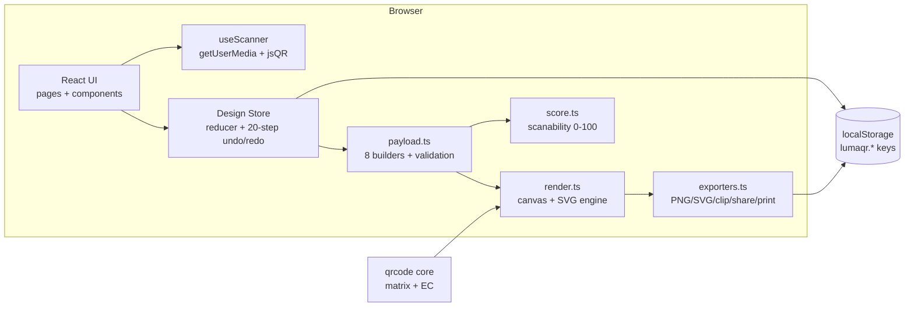

# LumaQR Studio

**Make it scan. Make it yours.**

LumaQR Studio is a premium, fully client-side QR design platform for creators, restaurants, cafés, events, shops, freelancers and small brands. It turns any link or piece of data into a beautiful, branded, **scan-verified** QR code — without a backend, an account, or a server round-trip.

---

## Screenshots

| Home (hero + animated QR) | Creator workspace |
| --- | --- |
| `_screenshots/home.png_ (add)` | `_screenshots/creator.png_ (add)` |

| Templates | My Designs |
| --- | --- |
| `_screenshots/templates.png_ (add)` | `_screenshots/designs.png_ (add)` |

## Live Demo

`_PASTE LIVE DEMO URL HERE_` (e.g. Vercel / Netlify / GitHub Pages deployment of `dist/`)

---

## Features

### Content (8 real types, validated as you type)
- **URL** — with protocol auto-detection and validation
- **Plain text**, **Email** (subject/body), **Phone**, **SMS** (segment warnings)
- **Wi-Fi** — SSID, password, WPA/WEP/open, hidden network, proper payload escaping
- **vCard** — name, company, title, phone, email, website, address (RFC-escaped)
- **Event** — iCalendar `VEVENT` with start/end, location, description

Every field shows helpful errors, long-content warnings, a live payload preview, and a clipboard paste button.

### Design
- Foreground/background colors, HEX input + native picker, **8 preset palettes** (Obsidian & White, Violet Pulse, Ocean Signal, Lime Tech, Sunset Studio, Royal Gold, Monochrome, Custom Brand)
- **Gradient dots** with direction control (canvas gradient + SVG `<linearGradient>`)
- Transparent background (real alpha in PNG/SVG, checkerboard proof in preview)
- Dot styles: **Square, Rounded, Soft, Pixel, Elegant** · Eye styles: **Square, Rounded, Dot, Triangle, R. Triangle**
- Corner/dot radius, quiet zone (0–10 modules), base size (256–1024 px), error correction **Low / Medium / Quartile / High**

### Branding
- Center **logo placement** (PNG/JPG/WebP/SVG, ≤2 MB, downscaled) with size, padding, plate background and opacity controls — size capped at 32% and High-EC recommended automatically
- **No fake background removal** — alpha PNGs or a plate color, and the UI says so
- **Smart Brand Mode**: one HEX (or an approximate logo color sample) → scan-safe palette with WCAG contrast check + safe style recommendation, one-click Apply

### QR Moods *(unique)*
Minimal, Luxury, Tech, Playful, Nature, Editorial, Festival, Corporate — one tap applies a matching palette, dot style, background, quiet zone and mockup. Everything stays fully editable.

### Smart Scanability Score *(real, not decorative)*
A 0–100 score computed from **WCAG contrast ratios**, quiet-zone width in modules, logo coverage, error-correction level, payload capacity utilization (probed from the encoder) and color safety (inversion/gradient penalties). Shows **Excellent / Good / Needs improvement** with actionable messages ("Increase contrast…", "Add more quiet zone", "Your logo is too large"). It never claims a code was scanned — only that it *should* be robust.

### Honest scan testing
- **Scan Preview** uses your camera (`getUserMedia`) + **jsQR** — a real decoder — entirely on-device
- Clear permission/unsupported explanations instead of fake results
- **Manual image test**: upload a screenshot/photo of the code and decode it locally
- Result is compared against the design's exact payload and shown verbatim

### Export (all real)
- **PNG** at 512 / 1024 / 2048 px, transparent option, custom filename, success toast
- **SVG** vector with gradients and embedded logo
- **Copy QR image** to clipboard (ClipboardItem), **Copy QR content**
- **Web Share API** with file share + honest fallback chain
- **Print-ready sheet** via an isolated print document
- 11 production **templates** that load working content *and* design into the creator

### My Designs
localStorage library with search, favorites, edit, duplicate, download, two-step delete, **JSON export** and **sanitized JSON import** (whitelist coercion, type checks, size caps).

### History & shortcuts
- Last **20 state changes** with real **Undo / Redo** (smart coalescing: typing/dragging = one step)
- `Ctrl/Cmd+Z` undo · `Ctrl/Cmd+Shift+Z` redo · `Ctrl/Cmd+S` save · `Ctrl/Cmd+E` jump to export — with an in-UI shortcut tooltip

### Product quality
Dark-first premium UI + full light mode, responsive two-column creator (mobile: controls → preview → bottom action bar), phone/card/poster/menu mockup previews, scan-pulse animation, ARIA labels, visible focus states, keyboard navigation, error boundary, 404 page, SEO metadata, favicon, reduced-motion support.

---

## Tech Stack

| Layer | Choice | Why |
| --- | --- | --- |
| Framework | **React 18 + TypeScript** | strict types across a large state surface |
| Build | **Vite 5** | fast dev + static deployable `dist/` |
| Styling | **Tailwind CSS 3** | dark/light design tokens, utility-driven UI |
| QR core | **qrcode** (node-qrcode) | battle-tested matrix + Reed–Solomon EC |
| Renderer | **custom canvas + SVG engine** (`src/lib/render.ts`) | pixel control over dots, eyes, gradients, logo; clean vector export |
| Scanning | **jsQR** | real on-device decode (camera frames & images) |
| Icons | **lucide-react** | consistent, tree-shaken |
| Routing | **react-router-dom 6** | 6 pages + 404 |
| State | React Context + `useReducer` | small, testable, no extra deps |
| Persistence | `localStorage` (versioned keys) | zero backend |

## Architecture



### Folder structure

```
src/
├── components/
│   ├── creator/      # ContentPanel, MoodBar, BrandKitPanel, ColorPanel,
│   │                 # StylePanel, LogoPanel, PreviewPanel, Mockups,
│   │                 # ScoreCard, ExportCard, ScanModal
│   ├── layout/       # Layout, Navbar, Footer, Logo, ErrorBoundary
│   └── ui/           # Button, Field, Slider, Switch, Segmented,
│                     # ColorField, Tooltip, Modal, misc (Badge/Kbd/Panel…)
├── hooks/            # useQRCanvas, useQRDataUrl, useScanner, useShortcuts
├── lib/
│   ├── render.ts     # matrix wrapper, canvas + SVG rendering engine
│   ├── payload.ts    # content → payload with validation
│   ├── score.ts      # scanability scoring + capacity probing
│   ├── palettes.ts   # presets, moods, brand kit derivation
│   ├── storage.ts    # localStorage + import sanitization
│   ├── exporters.ts  # download/clipboard/share/print
│   ├── templates.ts  # 11 template definitions
│   ├── demo.ts       # first-launch demo design
│   └── utils.ts      # color math, formatting
├── pages/            # Home, Create, Templates, Designs, HowItWorks, Settings, 404
├── store/            # designStore (history), settingsStore, toast
├── types/            # domain types + jsQR declaration
├── App.tsx · main.tsx · index.css
scripts/
├── smoke.ts          # 43 headless unit checks (payloads, sanitizer, scoring…)
└── decode-roundtrip.ts # 31 E2E checks: render → rasterize → real decode
```

## Installation

```bash
npm install
npm run dev          # http://localhost:5173
```

### Scripts

| Command | Purpose |
| --- | --- |
| `npm run dev` | Vite dev server (host 0.0.0.0, port 5173) |
| `npm run build` | Type-check (`tsc -b`) + production build to `dist/` |
| `npm run preview` | Serve the production build locally |
| `npm run smoke` | Headless unit checks **and** the real-decode round-trip suite |

### Environment variables

**None.** The app is fully client-side; no API keys, no `.env`, no secrets. (This is deliberate — see Privacy.)

## Deployment

Any static host works — the build output is a plain `dist/` folder:

```bash
npm run build
# upload dist/ to Vercel / Netlify / GitHub Pages / S3+CloudFront / nginx…
```

- **SPA rewrites**: serve `index.html` for unknown routes (Vercel/Netlify do this by default; on Netlify add a `_redirects` file with `/* /index.html 200`).
- **HTTPS required for scanning**: the camera API only works in secure contexts — deploy over HTTPS (all major hosts do by default).
- No environment configuration is needed after build.

## Privacy

- **No server, no accounts, no analytics, no trackers.** QR content never leaves the browser.
- Designs, settings, theme and template favorites persist in `localStorage` under versioned `lumaqr.*` keys; clearing site data removes everything.
- Camera frames are processed in-page by jsQR and never uploaded.
- JSON import is **sanitized**: whitelist coercion per field, type validation, string truncation, logo data-URL validation + 600 KB cap, 200-design import cap — untrusted files cannot smuggle markup or oversized data.
- Exported designs are portable backups of exactly what you stored.

## Accessibility

- Semantic landmarks, labelled form controls, `aria-invalid`/`aria-describedby` error wiring, `role="switch"`/`radiogroup` widgets, `aria-live` toasts
- Visible `:focus-visible` rings everywhere, keyboard-operable modals (Esc, focus trap, focus restore)
- Sliders are native `input[type=range]` (arrow-key friendly); color fields expose both a picker and a text HEX input
- WCAG-contrast-checked palette text in both themes; `prefers-reduced-motion` disables animations
- Canvas QR previews carry `role="img"` + descriptive labels

## Known Limitations

- **Triangle eyes are decorative**: no triangle geometry can reproduce the 1:1:3 finder phase, so the score penalizes them and tells you to verify with a real scan. Square/rounded/dot eyes are the scan-robust choices.
- **Inverted color** (light dots on dark background) is penalized by the score and may fail on cheap scanners — the scan test will show you the truth.
- **Gradient/colored dots** depend on strong contrast; the score flags low-contrast combinations.
- **Logo color extraction** is an alpha-weighted *average sample* of the image — an honest approximation, not palette extraction. Enter the exact HEX for precision.
- **No background removal** for logos — by design. Use alpha PNGs or the plate color.
- **Capacity probing** estimates max bytes per (version, EC) by probing the encoder; results match spec values (verified: v2-M = 26 B).
- The scan **score is an estimate** of physical robustness, never a scan result. Only the Scan Preview (real decode) can confirm scannability.
- SVG files for very large payloads (v30+) contain many elements; PNG is the recommended export for those.

## Roadmap

- [ ] Real-time camera *frame preview* with detected-region overlay
- [ ] Batch mode: generate variants (sizes/backgrounds) in one export
- [ ] Short-link-ready payload previews (your own redirect domain, still client-side)
- [ ] PDF export of the print sheet
- [ ] WebUSB/ble device testing hooks for field scans
- [ ] i18n (UI currently English)
- [ ] PWA offline install with the same zero-backend guarantees

## License

[MIT](./LICENSE)
